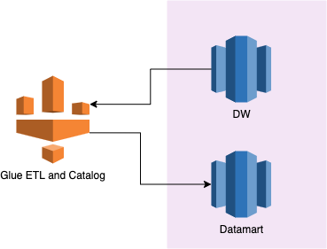

# An example of Glue ETL
This is an example of how to use Glue spark to read data from Redshift and run some transformations and then save the result back to Redshift.

The input data is json string, with struct or array as field. The main goal is to flatten the data, so that the result is in tabular shape.

## Things to highlight
1. Glue ETL is serverless and scalable, which are good properties for handling big data. Moreover, it is easy to run, so we choose it for this task.
2. For the requirement of `convert into a flat table`, the only array field is `brand_ids`, so it's mainly about `exploding` the field. 
3. As we don't have context information of the input data warehouse table, we load the whole table into Glue ETL. In real world application, we should only load new data or incremental data. A simple way could be using a timestamp field as flag to load data after certain time point. Here is a code sample of using query to load incremental data only:

```
query = "select * from <table_schema>.<table_name> where timestamp > '2021-08-01'"

connection_options = {
     "url": "jdbc:redshift://<host>:5439/<database>",
     "query": query,
     "user": "<username>",
     "password": "<password>",
     "redshiftTmpDir": args["TempDir"]
}

df = glueContext.create_dynamic_frame_from_options("redshift", connection_options).toDF()

```

## Architecture graph
In a real work application, if the data is already in data warehouse, we recommend ELT rather than ETL, which will save the effort (money and time) of getting data out of database.

However, the purpose of this work is to show how Glue spark talks to Redshift. 


## How to use
Use the code to create a spark job in AWS Glue.
Better having the Redshift tables crawled by Glue, so that they are recognised by Glue catalog.


